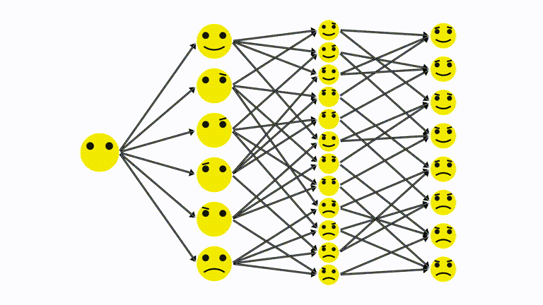

# gfn_animations
Some cute GFN animations with manim

Requirements: `manim` and `rdkit`, for `manim` works with [this commit](https://github.com/3b1b/manim/tree/d8428585f84681055fed8aa3fabfb6ae95e4a0ff) but [this patch](https://github.com/3b1b/manim/pull/2055) is required.

**Note**: with `DOT_DENSITY` set high enough (current default is 20), things can take quite a while to render (MolsFrags takes like 3-4 minutes on my laptop). For debugging consider setting `DOT_DENSITY` to 2 or 3.

**Credit**: If you feel like it, you can credit me (Emmanuel Bengio) for the animation, but feel free to reuse and make it your own.

GIFs are below but if you're looking for higher-quality prerendered mp4 equivalents check out [`videos`](videos/).

## Animations

### TheOriginalAnim

### Smileys

### SmileysWRewards

### SmileysFull

### MolsFrags

### MolsFragsSmall

